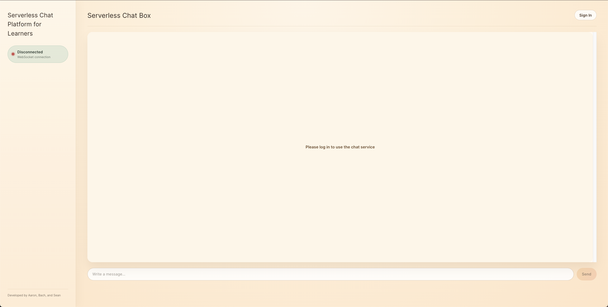
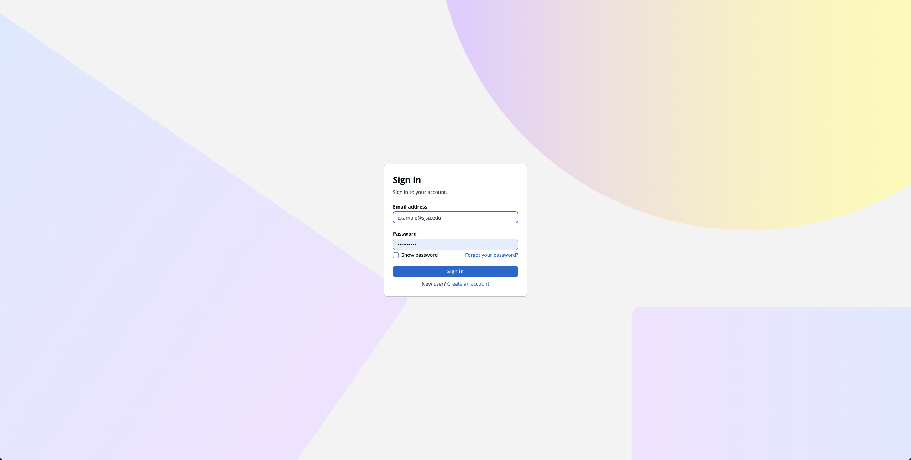
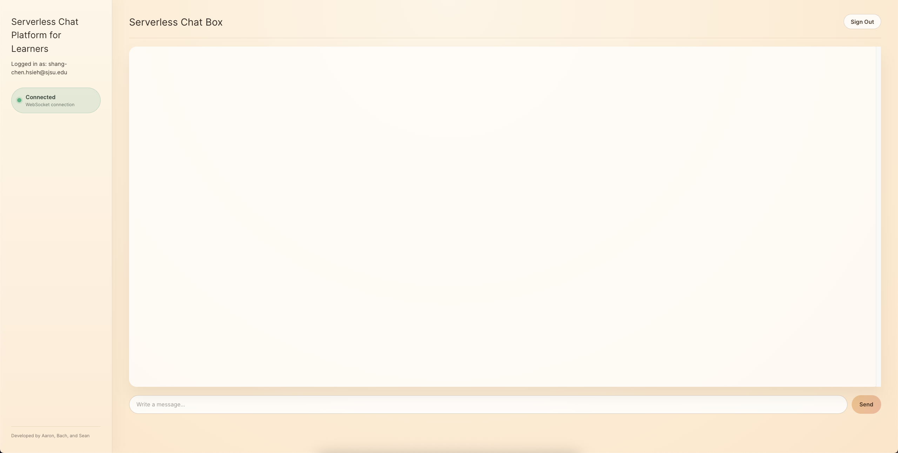
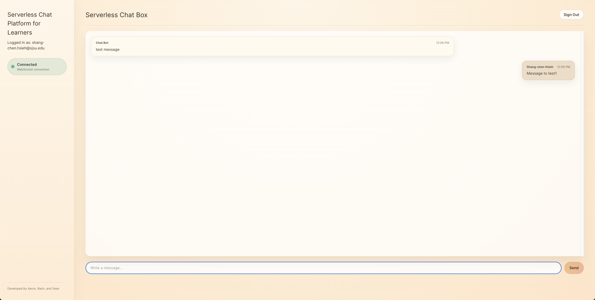

# serverless-chat-app-frontend

The frontend for a WebSocket chat app.

## Dependencies

- React
- react-use-websocket
- react-oidc-context + oidc-client-ts
- jwt-decode

## Environment Variables

- `VITE_WSS_URL`: The Websocket URL (`wss://<api id>.execute-api.<region>.amazonaws.com/<stage>`)
- `VITE_COGNITO_AUTHORITY`: Cognito URL (`https://cognito-idp.<region>.amazonaws.com/<user pool id>`)
- `VITE_COGNITO_CLIENT_ID`: The app client ID.
- `VITE_COGNITO_REDIRECT_URL`: The domain name of this site.

## Setup

```sh
mkdir project && cd project
git clone https://github.com/MikeJollie2707/serverless-chat-app-frontend.git .
npm i
npm run dev
```

## Usage


1. Not signed in — initial landing / sign-in prompt



2. Signed in (Cognito) — authenticated view



3. App interface — main chat layout



4. Messaging in action — sending/receiving messages


